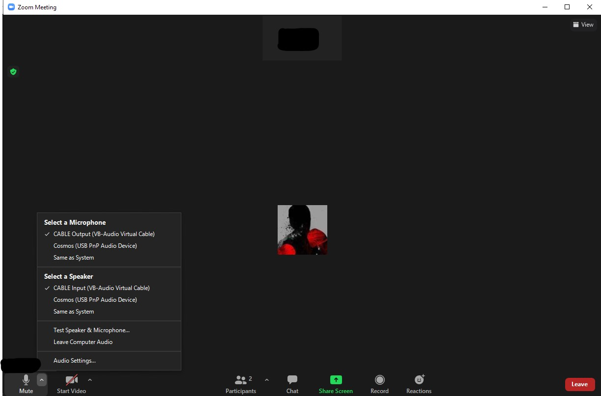
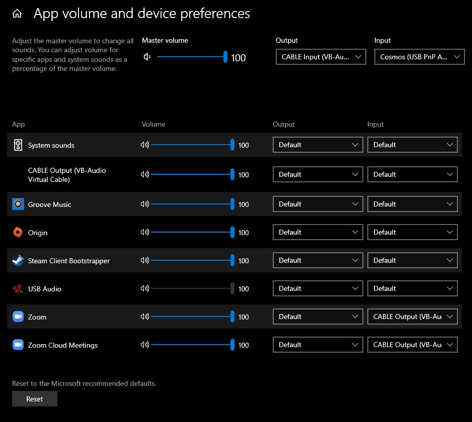
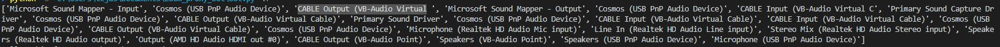

# ZOOM ATTENDANCE PROXY BOT
***
1. Install the required libraries using _pip_.
    `pip install -r requirements.txt`

2. Record the audio saying present and name the file as shown below, and save those files in `audio` folder.
	- `M` for Sir and `F` for Maam.
	
	

3. Install [Virtual Audio Cable](https://download.vb-audio.com/Download_CABLE/VBCABLE_Driver_Pack43.zip).
	
	

4. Setup Zoom's audio settings.

	

5. Change Windows device preferences as shown below. *NOTE : IT WILL ROUTE ALL YOUR SYSTEM SOUND TO ZOOM*

	

6. Change device_index to CABLE Output (VB-Audio Virtual) in *bot.py*.In the below the index is 2.
	
	

7. Run the below code in CMD in the installed directory.
	`python bot.py <M/F>`
	- use `M` for male lecturer and `F` for female.

8. It will alert you after 35 minutes to rejoin as zoom meetings will be only for 40 minutes.